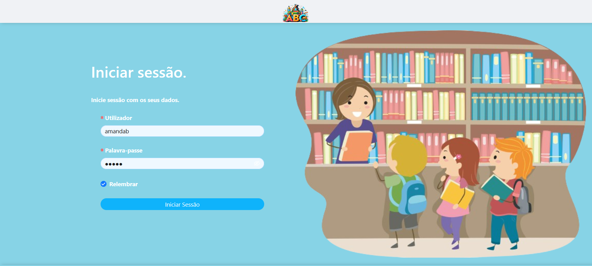
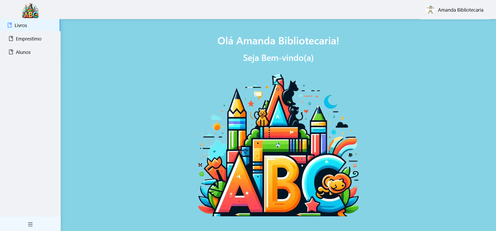
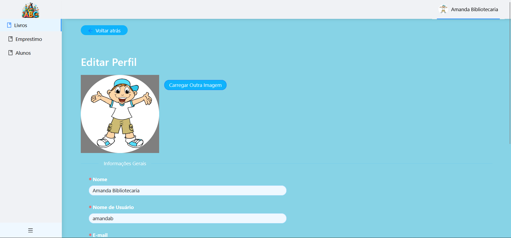

## Sistema para Gerenciamento de Biblioteca

Este projeto foi realizado na disciplina de Projeto e Desenvolvimento de Software da Universidade Federal do Maranhão. Consiste em um sistema para gerenciamento de biblioteca com três formas de usuário: administrador, aluno e bibliotecário. O back-end foi desenvolvido utilizando a tecnologia Netuno e o banco de dados H2, enquanto o front-end foi construído com React e Ant Design (AntD).

## Instalação

#### Netuno

[Siga as etapas aqui](https://doc.netuno.org/docs/en/installation/)

#### Aplicativo Biblioteca

Clone esse projeto para `(Netuno Root directory)/apps/Biblioteca/`.

## Configuração

> O processo a seguir é voltado para ambientes de desenvolvimento Linux, com algumas observações também destinadas a ambientes de desenvolvimento Microsoft Windows.

1. Copie o arquivo de configuração de amostra do aplicativo executando (no diretório raiz do aplicativo):

    * `cp config/sample.json config/_development.json` (para um ambiente de desenvolvimento)

    * `cp config/sample.json config/_production.json` (para um ambiente de produção)

    e ajuste o arquivo `_development.json` e/ou `_production_.json` de acordo com seu ambiente.

> Você pode alterar o nome do aplicativo alterando o nome da pasta e o parâmetro de configuração `name`.

2. Você precisará configurar uma conexão SMTP para que o recurso de recuperação de senha funcione corretamente, [saiba como fazer isso aqui] (https://doc.netuno.org/docs/en/academy/server/services/sending-emails/)

3. Você precisará configurar uma conexão do tipo banco de dados PostgreSQL para que esse aplicativo funcione corretamente [saiba como fazer isso aqui] (https://doc.netuno.org/docs/en/academy/server/database/psql/).

4. Localize e substitua a palavra `JWTRandomSecureSecret` por um código secreto, o mais aleatório possível, pois é isso que garante a segurança das credenciais dos usuários. Por exemplo: `#J&Az+7(8d+k/9q]` . [Ferramenta recomendada de geração de código seguro](https://passwordsgenerator.net/)

5. Você também precisará configurar o arquivo de configuração de amostra do site localizado em `website/src/config/`:

    1. Altere as configurações dentro de `_development_config.json` e `_production_config.json` para os ambientes de desenvolvimento e produção, respectivamente.

    2. Dentro da mesma pasta, execute `cp _development_config.json config.json` para criar o arquivo de configuração com base na configuração de desenvolvimento.

    > Para criar uma compilação pronta para produção, basta executar `bash build.sh` em `(diretório raiz do aplicativo)/website/`, que criará momentaneamente um `config.json` com base no arquivo de configuração de produção e, quando terminar, deverá reverter para a configuração de desenvolvimento.

    > Há também um `build.bat` presente em `(diretório raiz do aplicativo)/website/` para ambientes de desenvolvimento do Microsoft Windows.

6. Para configurar a definição do OpenAPI, consulte as configurações do `openapi` [saiba como fazer isso aqui] (https://doc.netuno.org/docs/en/academy/server/services/openapi/).

## Execução

No diretório raiz do Netuno, execute

`./netuno server app=Biblioteca`

e ele deverá iniciar o servidor back-end e o front-end.

> A primeira execução pode demorar um pouco devido à instalação das dependências do front-end.

Por padrão, o back office do Netuno estará disponível em:

- http://localhost:9000/

O OpenAPI estará em:

- http://localhost:9000/services/_openapi

E o front-end (site restrito) será iniciado em:

- http://localhost:3000/

## Estilo

Indicações para o estilo geral do site restrito.

### Escuro

Veja como o estilo escuro pode ser aplicado.

Ajuste as variáveis em `website/src/craco.config.js`:

```
  ...
  '@primary-color': '#1890ff',
  '@menu-bg': '#141414',
  '@layout-body-background': '#202020',
  '@layout-footer-background': '#303030',
  '@layout-header-background': '#141414',
  '@layout-trigger-color': '#eff8ff',
  ...
```

> [Lista completa de variáveis do Ant.Design] (https://github.com/ant-design/ant-design/blob/master/components/style/themes/default.less)

Em `website/src/styles/variables.less`, ajuste a importação do tema do Ant.Design, comente o tema padrão (claro) e descomente o tema escuro:

```
//@importar '~antd/lib/style/themes/default.less';
@importar '~antd/lib/style/themes/dark.less';
```

Em `website/src/App.js`, procure a tag de componente `Sider` e remova o atributo `theme=“light”`.

### Luz

Veja como o estilo claro pode ser aplicado.

Ajuste as variáveis em `website/src/craco.config.js`:

```
  ...
  '@primary-color': '#1890ff',
  '@menu-bg': '#ffffff',
  '@layout-body-background': '#ffffff', 
  '@layout-footer-background': '#eff8ff',
  '@layout-header-background': '#ffffff',
  '@layout-trigger-color': '#002140',
  ...
```

> [Lista completa de variáveis do Ant.Design] (https://github.com/ant-design/ant-design/blob/master/components/style/themes/default.less)

Em `website/src/styles/variables.less`, ajuste a importação do tema do Ant.Design, comente o tema escuro e descomente o padrão (claro):

```
@importar '~antd/lib/style/themes/default.less'; 
//@importar '~antd/lib/style/themes/dark.less';
```

Em `website/src/App.js`, procure a tag de componente `Sider` e adicione o atributo `theme=“light”`.

## Screenshots

Algumas capturas de tela abaixo.

### Desktop

##### Login

##### Reserved Area

##### Edit Profile

